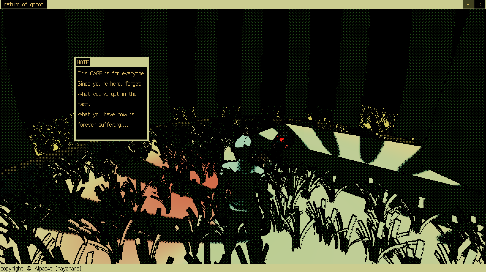
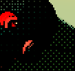
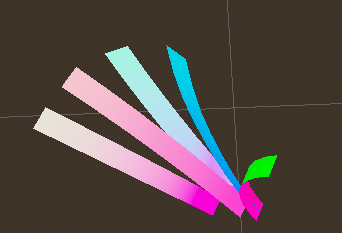
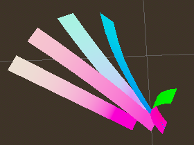

# 《风格测试：低像素抖动》说明
## A Godot Engine Project
<center>
    
</center>

## 版权信息
- 3D素材来源:sketchfab.com, Following CC-0 license.
- 动画来源：mixamo.com
- Codes: all rights reserved © Alpac4t (何星翰)

## 操作说明
1. 打开`low-pixel-dither.exe`。
如果出现问题，尝试使用控制台获取错误信息。

```bash
cd PATH
.\low-pixel-dither.console.exe
```

2. 程序内操作
- 移动：使用`W``A``S``D`操控角色的移动
- 旋转视角：移动鼠标旋转视角

3. 退出
点击右上角退出按钮退出程序。

## 亮点
- Dithering和low-bit rate的艺术风格
- 只用`MainLight`决定亮度，次要光源只渲染色彩的自定义NPR光照
- 利用`Global Uniform`实现方便的场景效果管理
- 利用`GPU Instancing`优化大量物体的实例化和渲染

## 实现

### Dithering

1. **全屏后处理**
   全屏四边形/三角形是后处理的常用思路，这里使用了全屏四边形的方案，通过在场景中设置四边形，再齐次裁剪时对其进行操作将其覆盖齐次裁剪空间。
```glsl
void vertex()
{
	POSITION = vec4(VERTEX,1.0);
}
```
2. **Bayer Matrix**
使用`Bayer Matrix`对屏幕中的像素进行处理，此处使用了4阶的`Bayer Matrix`。
```glsl
const float bayer_pattern[16] = {0.0,8.0,2.0,10.0,
								12.0,4.0,14.0,6.0,
								3.0,11.0,1.0,9.0,
								15.0,7.0,13.0,5.0};
```
3. **Ditherig Value**
为了保留场景中的色彩，进行更多的风格化处理（使用色彩进行强调和突出），这里选择只对像素的亮度进行处理，保留原本的色相和饱和度。
```glsl
vec3 color = rgb_to_hsv(scene_color);
// 采样拜尔阵列
int index = int(SCREEN_UV.x * VIEWPORT_SIZE.x) % 4 * 4 
		+ int(SCREEN_UV.y * VIEWPORT_SIZE.y) % 4;
float threshold = bayer_pattern[index] / 16.0;
// 对像素的明度做出操作
color.z *= step(clamp(threshold + 0.001,0,0.999),color.z);
```
<center>
    
    <br>
    <div style="color:orange; border-bottom: 1px solid #d9d9d9;
    display: inline-block;
    color: #999;
    padding: 2px;">最终效果</div>
</center>

### Sobel Outline
利用索贝尔算子进行屏幕空间的描边已经是寻常操作，这里使用了深度信息来优化描边的效果。
```glsl
vec2 du_data = getDepth(SCREEN_UV+1.0*vec2(x, y)*e,DEPTH_TEXTURE, INV_PROJECTION_MATRIX);
vec2 dd_data = getDepth(SCREEN_UV+0.5*vec2(x, y)*e, DEPTH_TEXTURE, INV_PROJECTION_MATRIX);
			
float du = du_data.x;
float dd = dd_data.x;
			
float dd_diff = clamp(abs((depth - dd) - (dd - du)), 0.0, 1.0);

float val = clamp(abs(depth - du), 0., 1.)/(x*x + y*y)*dd_diff*dd_diff*5000.0;
			
val = clamp(val, 0.0, 1.0);

depth_diff += val;

if (du < min_depth)
{
	min_depth = du;
	min_depth_data = du_data;
    c = texture(SCREEN_TEXTURE, SCREEN_UV+vec2(x, y)*e).rgb;
				
	c *= clamp(0.5+ 0.5*dot(normalize(vec2(x, y)), (vec2(0.0, 1.0))), 0.0, 1.0);
}
			
vec3 nu = texture(NORMAL_TEXTURE, SCREEN_UV+vec2(x, y)*e).rgb * 2.0 - 1.0;
			
depth_diff += (1.0-abs(dot(nu, normal)))/max(min(dd, depth), 2.0);
```

### Vertex Offset & Normal Correction
顶点偏移用来制作草的摇摆效果。
1. **顶点偏移**
```glsl
vec3 positionWS = VERTEX;
positionWS += wind_vector * (positionWS.y - NODE_POSITION_WORLD.y);
VERTEX = positionWS;
```
2. **(优化) Global Uniform**
使用`Global Uniform`统一调整场景中所有视觉效果。这里用来控制风的方向以及卡通渲染的光影阈值。
<center>
    
</center>

```glsl
global uniform vec3 wind_vector;
global uniform float threshold;
```
<center>
    <div style="color:orange; border-bottom: 1px solid #d9d9d9;
    display: inline-block;
    color: #999;
    padding: 2px;">Global Uniform</div>
</center>

3. **法线修正**
顶点虽然产生了偏移，但是法线还是原来的法线，会导致光照渲染得到预期之外的结果（这样的处理——法线映射——有时在NPR，例如头发的制作中有着无法替代的作用），因此我们需要对法线进行修正。
```glsl
vec3 tan_point = TANGENT * 0.1 + VERTEX;
BINORMAL = normalize(cross(NORMAL, TANGENT));
vec3 binormal_point = BINORMAL * 0.1 + VERTEX;
//....
// 在切线和副切线方向上设置两个小点，进行相同而函数变换
// 最后重新计算切线和副切线，最终得出法线
// 虽然可以直接对法线做出相同操作，但考虑到如果使用切线空间法线贴图需要正确的切线，故使用此操作
tan_point += wind_vector * (tan_point.y - NODE_POSITION_WORLD.y);
binormal_point += wind_vector * (tan_point.y - NODE_POSITION_WORLD.y);
	
NORMAL = normalize(cross(tan_point - positionWS, binormal_point - positionWS));
```
<center>
    <table>
    <td>
        
    </td>
    <td>
        
    </td>
    </table>
    <div style="color:orange; border-bottom: 1px solid #d9d9d9;
    display: inline-block;
    color: #999;
    padding: 2px;">法线修正前后(根部法线变化较为明显)</div>
</center>
   
### NPR & Lighting
1. Main Light
本项目中默认主光为`Directional Light`,简单使用光线和法线夹角配合自定义阈值做成二分效果。

2. Other Lights
其余光源只对像素的色相和饱和度产生影响。

```glsl
void light() 
{
	float dot_result = dot(NORMAL,LIGHT);
	if (LIGHT_IS_DIRECTIONAL)
	{
		DIFFUSE_LIGHT += step(threshold, dot_result) * ATTENUATION * LIGHT_COLOR;
	}
	else
	{
		float v = rgb_to_hsv(DIFFUSE_LIGHT).z;
		vec3 color = DIFFUSE_LIGHT + ATTENUATION * LIGHT_COLOR;
		color = vec3(rgb_to_hsv(color).rg,v);
		DIFFUSE_LIGHT = hsv_to_rgb(color);
	}
}
```
